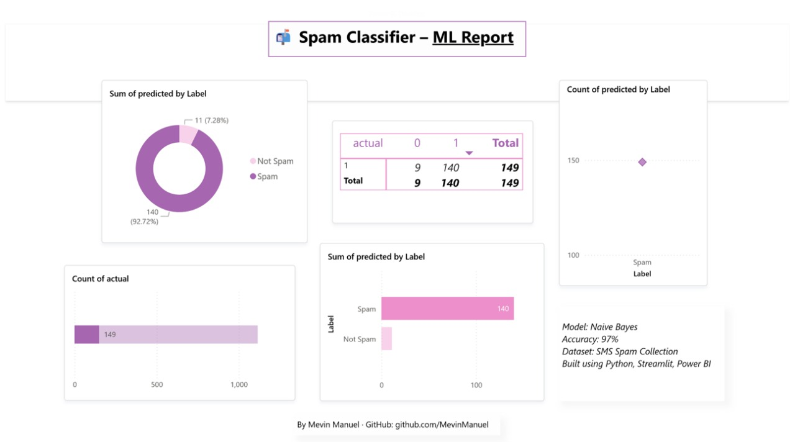

# 📬 SMS Spam Classifier – Streamlit Web App

A beginner-friendly **machine learning web application** that classifies SMS messages as **spam** or **not spam** using natural language processing (NLP) and a **Naive Bayes classifier**.

Built with **Streamlit**, **scikit-learn**, and **CountVectorizer**, this app offers a simple interface to test spam prediction in real time.


---

## 🧠 Features

- ✅ Predicts if a message is Spam or Not Spam
- 🧹 Preprocessing with `CountVectorizer`
- 🤖 Model trained using `MultinomialNB`
- 🧾 Simple UI built with **Streamlit**
- 🧠 Custom input prediction
- 📦 Deployable on **Streamlit Cloud**

---

## 🚀 Live Demo

Try the app on Streamlit Cloud:  
👉 [https://spam-classifier-appl.streamlit.app/](https://spam-classifier-appl.streamlit.app/)  

---

## 📁 Project Structure

spam-classifier-app/ <br>
├── app.py # Streamlit app <br>
├── spam_model.pkl # Trained Naive Bayes model <br>
├── vectorizer.pkl # Fitted CountVectorizer <br>
├── requirements.txt # Required Python packages <br>
└── README.md # Project documentation <br>


---

## 🛠 Tech Stack

| Tool             | Role                        |
|------------------|-----------------------------|
| Python           | Programming language        |
| Streamlit        | Web app framework           |
| scikit-learn     | ML model and vectorizer     |
| joblib           | Model serialization         |
| pandas           | Data manipulation           |
| CountVectorizer  | Text to numeric conversion  |

---

## 🔍 How It Works

1. Preprocess the text message (lowercase, tokenize, remove punctuation)
2. Transform message to a vector using `CountVectorizer`
3. Predict class (`Spam` or `Ham`) using `Multinomial Naive Bayes`
4. Display result using Streamlit interface

---

## 📦 Installation (Local)

### 1. Clone the repo
```bash
git clone https://github.com/MevinManuel/spam-classifier-app.git
cd spam-classifier-app
```

2. Install dependencies
```bash
pip install -r requirements.txt
```

3. Run the Streamlit app
```bash
streamlit run app.py
```

🔐 Requirements
File: requirements.txt

```nginx
streamlit
scikit-learn
joblib
pandas
```

🧪 Example Usage
Input:
"Congratulations! You’ve won a free iPhone. Claim now!"

Output:
🚫 Spam

Input:
"Hey, are we meeting at 6 for dinner?"

Output:
✅ Not Spam

🧑‍💻 Author <br>
Mevin Manuel
<br>
<br>
📧 Mevinmnl123@gmail.com <br>
🔗 LinkedIn: https://www.linkedin.com/in/mevin-manuel-b3b670275/ <br>
🔗 GitHub: https://github.com/MevinManuel <br>

📄 License <br>
This project is open-sourced under the MIT License.

📢 Feedback <br>
If you liked this project or have suggestions to improve it, feel free to ⭐️ star the repo or open an issue!

And also if you've made it this far, wow, you're either really interested or really bored. Either way, thanks for sticking around! 😄
